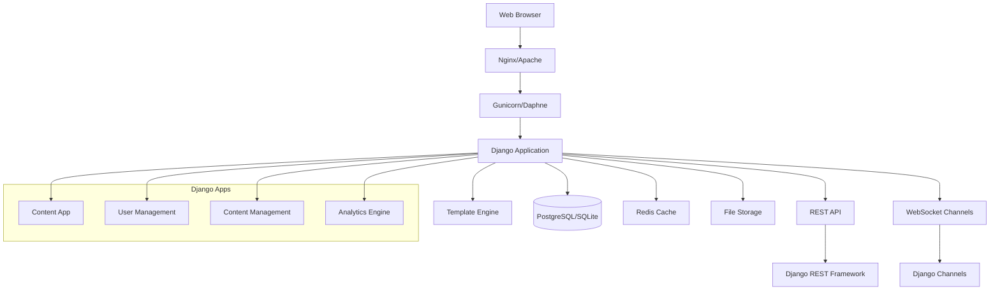
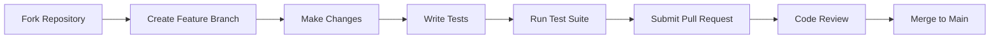

# 🌍 GDA - Global Development Alliance

[](https://djangoproject.com/)
[](https://python.org/)
[](https://opensource.org/licenses/MIT)
[](https://github.com/Anurag-Shankar-Maurya/GDA/actions)
[](CONTRIBUTING.md)
[](https://hub.docker.com/r/anuragsm/gda)
[](https://vercel.com/new/clone?repository-url=https://github.com/Anurag-Shankar-Maurya/GDA)

> A sophisticated Django-based Content Management System engineered for international volunteer organizations to orchestrate volunteer projects, optimize user engagement, and streamline organizational content management.


[🌐 Live Demo](https://gda-public.vercel.app/) | [📚 Documentation](https://github.com/Anurag-Shankar-Maurya/GDA/wiki) | [🤝 Contributing](CONTRIBUTING.md)

## 📋 Table of Contents

- [🌟 Overview](#-overview)
- [✨ Key Features](#-key-features)
- [🏗️ Architecture](#️-architecture)
- [🚀 Technology Stack](#-technology-stack)
- [📋 Prerequisites](#-prerequisites)
- [🛠️ Installation](#️-installation)
- [⚙️ Configuration](#️-configuration)
- [📖 Usage Guide](#-usage-guide)
- [🧪 Testing](#-testing)
- [🚀 Deployment](#-deployment)
- [🌐 Internationalization and Localization](#-internationalization-and-localization)
- [🤝 Contributing](#-contributing)
- [📄 License](#-license)
- [👥 Support](#-support)
- [🙏 Acknowledgments](#-acknowledgments)

## 🌟 Overview

The Global Development Alliance (GDA) platform represents a cutting-edge solution for volunteer coordination and impact measurement. Built with enterprise-grade Django framework, it provides comprehensive tools for managing international volunteer programs, tracking participant engagement, and showcasing organizational success stories.

### 🎯 Mission
To empower volunteer organizations with data-driven insights and streamlined management capabilities, fostering sustainable global development through enhanced volunteer coordination.

### 📊 Impact Metrics
- **500+** Active Volunteer Projects
- **10,000+** Registered Participants
- **50+** Partner Organizations
- **Real-time** Analytics Dashboard

## ✨ Key Features

### 🏗️ Project Management Suite
- **Comprehensive Project Lifecycle**: From inception to completion tracking.
- **Advanced Enrollment System**: Automated capacity management and waitlist handling.
- **Multi-dimensional Filtering**: Theme, location, duration, and difficulty-based project discovery.
- **Performance Analytics**: Real-time enrollment tracking and utilization metrics.

### 👥 User Management & Analytics
- **Sophisticated User Profiles**: Detailed participant information with guardian verification.
- **Social Authentication**: Seamless login with Google, Facebook, and GitHub.
- **Demographic Intelligence**: Gender, country, and engagement pattern analysis.
- **Behavioral Analytics**: User activity tracking and engagement scoring.
- **Advanced Search Engine**: Multi-criteria user discovery and management.

### 📝 Content Management System
- **Dynamic News Platform**: Real-time news and event publication system.
- **Multimedia Success Stories**: Rich content creation with image and video integration.
- **Intelligent FAQ Management**: Categorized knowledge base with priority ordering.
- **SEO-Optimized Content**: Search engine friendly content structure.

### 📊 Business Intelligence Dashboard
- **Executive Summary**: High-level organizational metrics and KPIs.
- **Interactive Data Visualization**: Chart.js-powered analytics with real-time updates.
- **Custom Reporting**: Exportable reports for stakeholder communication.
- **Performance Monitoring**: System health and user engagement tracking.

### 🌐 Internationalization and Localization
- **Multi-language Support**: Full support for English and Traditional Chinese (zh_TW).
- **Translatable Content**: All models and templates are designed for easy localization.
- **Automated Translation Files**: `makemessages` and `compilemessages` for streamlined translation workflows.

### 🚀 API and Integrations
- **RESTful API**: A comprehensive REST API for projects, news, success stories, and user data.
- **API Documentation**: Auto-generated Swagger and ReDoc documentation for all endpoints.
- **External Service Integration**: KICC project data synchronization.
- **Secure API Access**: Token-based authentication and permission classes.

## 🏗️ Architecture



### System Components
- **Frontend Layer**: Responsive Bootstrap 5 interface with Chart.js visualizations
- **Application Layer**: Django 5.2.6 with modular app architecture
- **Data Layer**: PostgreSQL for production, SQLite for development
- **API Layer**: Django REST Framework for RESTful services
- **Media Layer**: Local storage with cloud storage capability

## 🚀 Technology Stack

| Component | Technology | Version | Purpose |
|-----------|------------|---------|---------|
| **Backend** | Django | 5.2.6 | Web Framework |
| **Database** | PostgreSQL/SQLite | 15+/3+ | Primary Data Store |
| **Frontend** | Bootstrap | 5.3 | UI Framework |
| **JavaScript** | Vanilla JS | ES6+ | Client-side Logic |
| **Charts** | Chart.js | 4.0+ | Data Visualization |
| **API** | Django REST | 3.16.1 | RESTful Services |
| **Deployment** | Gunicorn/Vercel | 21+ | WSGI Server/Hosting |
| **Container** | Docker | 24+ | Containerization |
| **Web Server** | Nginx | 1.25+ | Reverse Proxy |
| **Python** | Python | 3.11+ | Programming Language |

## 📋 Prerequisites

### System Requirements
- **Operating System**: Linux/Windows/macOS
- **Python Version**: 3.11 or higher
- **Memory**: Minimum 1GB RAM (2GB recommended)
- **Storage**: 200MB free space for application and database
- **Network**: Stable internet connection for dependency installation

### Development Tools
- Git version control system
- Virtual environment manager (venv)
- Code editor (VS Code recommended)
- Docker (optional, for containerized development)
- Database client (optional, for PostgreSQL development)

## 🛠️ Local Development Setup

These instructions will get you a copy of the project up and running on your local machine for development and testing purposes.

### Prerequisites

*   Python 3.11+
*   Git
*   A virtual environment manager (like `venv`)

### 1. Clone the Repository

```bash
git clone https://github.com/Anurag-Shankar-Maurya/GDA-Public.git
cd GDA-Public
```

### 2. Set Up Virtual Environment

```bash
# Create and activate a virtual environment
python -m venv venv
# On Windows Powershell
venv\Scripts\activate
# On Windows Bash
source venv/Scripts/activate
# On macOS/Linux
source venv/bin/activate
```

### 3. Install Dependencies

```bash
# Upgrade pip and install packages
pip install --upgrade pip
pip install -r requirements.txt
```

### 4. Configure Environment

The project uses an `.env` file for environment variables.

```bash
# Create a .env file from the example
cp .env.example .env
```

Now, open the `.env` file and set a `SECRET_KEY`. You can generate one using Django's `get_random_secret_key()` function. For local development, the default `sqlite3` database will be used.

### 5. Set Up the Database

```bash
# Run database migrations
python manage.py migrate

# Create a superuser to access the admin panel
python manage.py createsuperuser
```

### 6. Run the Development Server

```bash
python manage.py runserver
```

You can now access the application:
*   **Main Site:** [http://1227.0.0.1:8000/](http://127.0.0.1:8000/)
*   **Management Dashboard:** [http://127.0.0.1:8000/management/](http://127.0.0.1:8000/management/)

## ⚙️ Environment Variables

This project uses a `.env` file to manage environment variables for both local development and production. To get started, copy the example file:

```bash
cp .env.example .env
```

Then, open the `.env` file and fill in the required values as described below.

### Django Core Settings

-   `SECRET_KEY`: A long, random string used for cryptographic signing. **Required for production.**
-   `DEBUG`: Set to `True` for local development to get detailed error pages. **Must be `False` in production.**

### Database Configuration

-   `USE_POSTGRES`: Set to `True` to use a PostgreSQL database (recommended for production) or `False` to use the default `sqlite3` database (convenient for local development).
-   `DB_NAME`, `DB_USER`, `DB_PASSWORD`, `DB_HOST`, `DB_PORT`: Credentials for your PostgreSQL database. These are only required if `USE_POSTGRES` is set to `True`.

*Note: For production deployments on services like Render or Vercel, you might use a single `DATABASE_URL` string instead, which `dj-database-url` will parse.*

### Email Delivery

These settings are required for features like email verification and password resets.

-   `EMAIL_BACKEND`: The backend to use for sending emails. `django.core.mail.backends.smtp.EmailBackend` is standard.
-   `EMAIL_HOST`, `EMAIL_PORT`, `EMAIL_HOST_USER`, `EMAIL_HOST_PASSWORD`: Your SMTP server credentials. For Gmail, consider using an "App Password" for better security.
-   `EMAIL_USE_SSL`: Set to `True` for secure connections (e.g., port 465).
-   `DEFAULT_FROM_EMAIL`: The default email address for automated messages.

### Deployment Security

These settings should be enabled when deploying your application over HTTPS in production.

-   `SECURE_SSL_REDIRECT`: Set to `True` to redirect all HTTP requests to HTTPS.
-   `SESSION_COOKIE_SECURE`: Set to `True` to only send session cookies over HTTPS.
-   `CSRF_COOKIE_SECURE`: Set to `True` to only send the CSRF cookie over HTTPS.
-   `SECURE_HSTS_SECONDS`, `SECURE_HSTS_INCLUDE_SUBDOMAINS`, `SECURE_HSTS_PRELOAD`: Settings for HTTP Strict Transport Security (HSTS). Be cautious when enabling these, as they can have long-term effects on browser behavior.

### Social Authentication (OAuth)

To enable social logins, you need to obtain API credentials from each provider and add them to your `.env` file.

-   **Google**:
    -   `GOOGLE_CLIENT_ID`, `GOOGLE_CLIENT_SECRET`
    -   Get credentials from the [Google Cloud Console](https://console.cloud.google.com/).
    -   Set the authorized redirect URI to: `http://127.0.0.1:8000/accounts/google/login/callback/` (for local development).

-   **Facebook**:
    -   `FACEBOOK_CLIENT_ID`, `FACEBOOK_CLIENT_SECRET`
    -   Get credentials from [Meta for Developers](https://developers.facebook.com/).
    -   Set the valid OAuth redirect URI to: `http://127.0.0.1:8000/accounts/facebook/login/callback/`.

-   **GitHub**:
    -   `GITHUB_CLIENT_ID`, `GITHUB_CLIENT_SECRET`
    -   Get credentials from your [GitHub Developer settings](https://github.com/settings/developers).
    -   Set the authorization callback URL to: `http://127.0.0.1:8000/accounts/github/login/callback/`.


## 📖 Usage Guide

### Database Seeding

The project provides two seeding commands for populating the database:

#### Production Data Seeding

To populate the database with production data from CSV files:

```bash
# Seed production data from CSV files
python manage.py seed_production

# Clear existing data and reseed production data
python manage.py seed_production --clear
```

This command reads data from CSV files located in `apps/content/data/` and creates:
- **42 Projects** - Volunteer opportunities with complete details
- **28 NewsEvents** - News articles and event announcements
- **52 SuccessStories** - Volunteer reflections and impact stories
- **8 FAQs** - Frequently asked questions with voting data

**Note:** The `--clear` option will delete all existing content data before seeding.

#### Development Sample Data

To populate the database with sample data for development and testing:

```bash
python manage.py seed
```

This command creates:
- Sample user accounts (with default password: `password123`)
- Example volunteer projects across different themes and countries
- News articles and events
- Success stories linked to projects
- Frequently asked questions

**Note:** Both seed commands use `get_or_create` to avoid duplicating data, so they're safe to run multiple times.

### Admin Panel Access

After running migrations and creating a superuser, you can access the Django admin panel at:
- **Admin Panel:** [http://127.0.0.1:8000/admin/](http://127.0.0.1:8000/admin/)

Use the superuser credentials you created during setup.

### API Documentation

The project includes auto-generated API documentation using DRF-YASG:
- **Swagger UI:** [http://127.0.0.1:8000/swagger/](http://127.0.0.1:8000/swagger/)
- **ReDoc:** [http://127.0.0.1:8000/redoc/](http://127.0.0.1:8000/redoc/)

### Internationalization

To update translation files:

```bash
# Generate translation files for Chinese (Taiwan)
python manage.py makemessages -l zh_TW --ignore venv

# Compile translation files
python manage.py compilemessages
```

### Key Application Features

#### For Volunteers
- Browse and apply for volunteer projects
- View project details, requirements, and timelines
- Track application status and enrolled projects
- Access success stories and impact metrics

#### For Administrators
- Manage projects, users, and content through the admin panel
- Monitor volunteer engagement and project progress
- Publish news, events, and announcements
- Generate reports and analytics

## 🧪 Testing Guidelines

This project includes a small test suite and follows standard Django test discovery rules. Below are recommended workflows and tips for running and structuring tests locally and in CI.

Quick commands

```bash
# Run all tests (verbose)
python manage.py test -v 2

# Run tests for a single app
python manage.py test apps.content -v 2

# Run an individual test case or test method
python manage.py test apps.content.tests.SmokeTest.test_homepage_loads -v 2
```

Test structure and best practices

- Place tests in `tests.py` inside each app or create a `tests/` package inside the app.
- Name test modules and functions/classes using the `test` prefix so Django/unittest discovers them (e.g., `tests.py`, `tests/test_models.py`, `TestMyModel.test_saves`).
- Keep tests small and deterministic. Prefer factory fixtures or Django's `TestCase.setUp()` for test data.
- Use Django's `TestCase` for tests that need database access; it wraps each test in a transaction and flushes the DB between tests.
- For faster unit tests that don't use the DB, use `SimpleTestCase` or plain `unittest.TestCase`.

Running tests in CI

- Run `python -m pip install -r requirements.txt` before running tests (or use the project image from your CI pipeline).
- Use an in-memory SQLite DB for unit tests if you want speed (`DATABASE_URL=sqlite:///:memory:`) or configure a real PostgreSQL service for integration tests.
- Fail the build on any warnings in `python manage.py check --deploy` when running in production mode (i.e., `DEBUG=False`).

Debugging test failures

- Re-run a single failing test with increased verbosity: `python manage.py test path.to.test -v 3`.
- Use `--keepdb` to avoid rebuilding the test DB during iterative debugging:

```bash
python manage.py test -v 2 --keepdb
```

- If tests fail because of missing environment variables (e.g., `SECRET_KEY`), create a local `.env` from `.env.example` and export the values in your shell or CI secrets.

Writing new tests

- Add tests when fixing bugs or adding features. Aim to cover model logic, view behavior, form validation, and key templates.
- Use factories (e.g., Factory Boy) or fixtures to build test data where helpful.

CI recommendations

- Add a workflow that installs dependencies, runs `python manage.py check --deploy` with production-like env vars, and then runs `python manage.py test`.
- Consider splitting unit tests (fast) and integration tests (slow) into separate CI jobs.


## 🚀 Production Deployment

This project is configured for deployment using either Docker or Vercel.

### Option 1: Deploying with Docker

This is the recommended method for a full production-like environment with Nginx and PostgreSQL.

#### Prerequisites

*   Docker
*   Docker Compose

#### 1. Configure Environment

Create a `.env` file in the project root and add the following variables:

```
DEBUG=False
SECRET_KEY=<your-strong-secret-key>
```
The `DATABASE_URL` is already configured in `docker-compose.yml` to connect to the PostgreSQL service.

#### 2. Build and Run the Containers

```bash
docker-compose build # Build the Docker images

docker-compose up -d --build # Build and start the containers in detached mode
```

This command will build the Docker image for the web service, and start the `web`, `db` (PostgreSQL), and `nginx` services in detached mode.

#### 3. Accessing the Application

The application will be available at `http://localhost`. Nginx is configured to listen on port 80.

### Option 2: Deploying to Render

Deploying to Render is a straightforward process. Here are the detailed steps to get your web service live:

#### 1. Create a New Web Service
- From your Render dashboard, click the **"New"** button and select **"Web Service"**.

#### 2. Connect Your Repository
- Connect your GitHub account and select your repository (e.g., `Anurag-Shankar-Maurya/GDA-Public`).

#### 3. Configure Service Settings
Fill out the configuration form with the following details:
- **Name**: A unique name for your web service (e.g., `gda-production`).
- **Region**: Choose a region that is geographically close to your users (e.g., Oregon (US West)).
- **Branch**: Select the Git branch to build and deploy from (e.g., `main`).
- **Root Directory**: Leave this blank unless you are using a monorepo structure.
- **Runtime**: Select **Python 3**.
- **Build Command**: Set this to `pip install -r requirements.txt`.
- **Start Command**: Use `python manage.py collectstatic --noinput && gunicorn gda.wsgi:application`.
- **Instance Type**: For hobby projects or testing, you can start with the **Free** instance type. For production use, consider a paid instance for better performance and features like zero-downtime deploys.

#### 4. Add Environment Variables
- Under the **"Environment Variables"** section, you can add your secrets and configuration.
- You can add them one by one or use the **"Add from .env"** option to bulk-upload them from your local `.env` file.
- **Required variables for production:**
    - `SECRET_KEY`: Your production secret key.
    - `DEBUG`: Set to `False`.
    - `DATABASE_URL`: Your Render PostgreSQL database connection string.
    - `PYTHON_VERSION`: Specify your Python version, e.g., `3.11.0`.

#### 5. Create Web Service
- Click the **"Create Web Service"** button at the bottom of the page. Render will automatically start the build and deployment process.

### Option 3: Deploying to Vercel

Vercel provides a seamless deployment experience for Django projects. Here’s how to get your project live:

#### 1. Create a New Project
- From your Vercel dashboard, click the **"Add New..."** button and select **"Project"**.

#### 2. Import Your Git Repository
- Connect your GitHub account and select your repository (e.g., `Anurag-Shankar-Maurya/GDA-Public`).
- Click the **"Import"** button.

#### 3. Configure Your Project
- **Project Name**: Vercel will automatically use your repository name, but you can customize it.
- **Framework Preset**: Vercel should automatically detect that this is a Django project or leave at **others** to take every thing from `vercel.json` file.
- **Root Directory**: Leave this as the default unless your project is in a subdirectory.

#### 4. Add Environment Variables
- Expand the **"Environment Variables"** section.
- You can add your secrets and configuration variables one by one or paste the contents of your `.env` file.
- **Required variables for production:**
    - `SECRET_KEY`: Your production secret key.
    - `DEBUG`: Set to `False`.
    - `DATABASE_URL`: Your production database connection string (e.g., from a Vercel Postgres database).
    - `PYTHON_VERSION`: Specify your Python version, e.g., `3.11`.

#### 5. Deploy
- Click the **"Deploy"** button. Vercel will start the build and deployment process.
- The `vercel.json` file in the repository root is already configured to handle the build process and routing for the Django application.

The current live demo is hosted on Vercel.

### Option 4: Manual Deployment with WSGI/ASGI

For a more traditional deployment on a virtual machine or a bare-metal server, you can use a production-grade WSGI or ASGI server.

#### WSGI Deployment (e.g., with Gunicorn)

Gunicorn is a mature and widely used WSGI server for Unix-like systems.

```bash
# Install Gunicorn
pip install gunicorn

# Run the application with Gunicorn
gunicorn gda.wsgi:application --bind 0.0.0.0:8000 --workers 4
```

On Windows, you can use `waitress`:
```bash
# Install Waitress
pip install waitress

# Run the application with Waitress
waitress-serve --listen=0.0.0.0:8000 gda.wsgi:application
```

#### ASGI Deployment (e.g., with Uvicorn)

If your application has asynchronous features (like Django Channels), you should use an ASGI server like Uvicorn.

```bash
# Install Uvicorn
pip install uvicorn

# Run the application with Uvicorn
uvicorn gda.asgi:application --host 0.0.0.0 --port 8000 --workers 4
```
## 🤝 Contributing

We welcome contributions from the community! Please see our [Contributing Guidelines](CONTRIBUTING.md) for detailed information.

### Development Workflow


### Code Standards
- **PEP 8**: Python style guide compliance
- **Django Best Practices**: Framework-specific conventions
- **Documentation**: Comprehensive docstrings and comments
- **Testing**: Minimum 80% code coverage

### Commit Message Format
```
type(scope): description

[optional body]

[optional footer]
```

Types: `feat`, `fix`, `docs`, `style`, `refactor`, `test`, `chore`

## 📄 License

This project is licensed under the MIT License - see the [LICENSE](LICENSE) file for details.

```
MIT License

Copyright (c) 2024 Global Development Alliance

Permission is hereby granted, free of charge, to any person obtaining a copy
of this software and associated documentation files (the "Software"), to deal
in the Software without restriction, including without limitation the rights
to use, copy, modify, merge, publish, distribute, sublicense, and/or sell
copies of the Software, and to permit persons to whom the Software is
furnished to do so, subject to the following conditions:

The above copyright notice and this permission notice shall be included in all
copies or substantial portions of the Software.
```

## 👥 Support

### Getting Help
- 📧 **Email**: anuragshankarmaurya@gmail.com
- 💬 **GitHub Discussions**: [Join the conversation](https://github.com/Anurag-Shankar-Maurya/GDA/discussions)
- 📖 **Wiki**: [Project Wiki](https://github.com/Anurag-Shankar-Maurya/GDA/wiki)
- 🐛 **Issue Tracker**: [GitHub Issues](https://github.com/Anurag-Shankar-Maurya/GDA/issues)

### Support Options
- **Community Support**: GitHub issues and discussions
- **Bug Reports**: Submit via GitHub Issues
- **Feature Requests**: Submit via GitHub Discussions
- **Security Issues**: Send directly to anuragshankarmaurya@gmail.com

## 🙏 Acknowledgments

### Core Team
- **Lead Developer**: [Anurag Shankar Maurya](https://github.com/Anurag-Shankar-Maurya)
- **Contributors**: Open source community members
- **Testers**: Community beta testers

### Technology Stack
- [Django](https://www.djangoproject.com/): The web framework for perfectionists with deadlines
- [Bootstrap](https://getbootstrap.com/): The world's most popular frontend toolkit
- [Chart.js](https://www.chartjs.org/): Simple yet flexible JavaScript charting
- [PostgreSQL](https://www.postgresql.org/): The world's most advanced open source database
- [Docker](https://www.docker.com/): Containerization platform

### Special Thanks
To the open source community and all contributors who help make this project better.

---

<div align="center">

**Built with ❤️ by [Anurag Shankar Maurya](https://github.com/Anurag-Shankar-Maurya)**

[](https://github.com/Anurag-Shankar-Maurya/GDA)
[](https://github.com/Anurag-Shankar-Maurya/GDA)

*Empowering volunteer organizations through technology*

</div>
