<div align="center">

# 🌍 Global Development Alliance
### *Empowering Change Through Technology*

<p align="center">
  
</p>

[](https://djangoproject.com/)
[](https://python.org/)
[](https://opensource.org/licenses/MIT)
[](https://github.com/Anurag-Shankar-Maurya/GDA-Public/actions)

[](https://hub.docker.com/r/anuragsm/gda)
[](https://vercel.com/new/clone?repository-url=https://github.com/Anurag-Shankar-Maurya/GDA-Public)
[](https://postgresql.org/)
[](https://github.com/Anurag-Shankar-Maurya/GDA-Public)

<h3>
  <a href="https://gda-public.vercel.app/">🚀 Live Demo</a>
  <span> · </span>
  <a href="https://github.com/Anurag-Shankar-Maurya/GDA-Public/wiki">📚 Documentation</a>
  <span> · </span>
  <a href="CONTRIBUTING.md">🤝 Contributing</a>
</h3>

> **A sophisticated Django-powered CMS engineered for international volunteer organizations**  
> *Orchestrate volunteer projects · Optimize engagement · Streamline content management*

</div>

---

<div align="center">
  
</div>

---

## 📑 Table of Contents

<details>
<summary><b>Click to expand navigation</b></summary>
<br>

- [🌟 Overview](#-overview)
- [✨ Key Features](#-key-features)
- [🏗️ Architecture](#️-architecture)
- [🚀 Technology Stack](#-technology-stack)
- [📋 Prerequisites](#-prerequisites)
- [🛠️ Installation](#️-installation)
- [⚙️ Configuration](#️-configuration)
- [📖 Usage Guide](#-usage-guide)
- [🧪 Testing](#-testing)
- [🚀 Deployment](#-deployment)
- [🌐 Internationalization and Localization](#-internationalization-and-localization)
- [🤝 Contributing](#-contributing)
- [📄 License](#-license)
- [👥 Support](#-support)
- [� License](#-license)
- [👥 Support](#-support)
- [🙏 Acknowledgments](#-acknowledgments)

</details>

---

## 🌟 Overview

<table>
<tr>
<td width="50%">

### 🎯 Our Mission

To **empower volunteer organizations** with data-driven insights and streamlined management capabilities, fostering sustainable global development through enhanced volunteer coordination.

The GDA platform represents a cutting-edge solution for volunteer coordination and impact measurement. Built with enterprise-grade Django framework, it provides comprehensive tools for managing international volunteer programs, tracking participant engagement, and showcasing organizational success stories.

</td>
<td width="50%">

### 📊 Impact at a Glance

```text
┌─────────────────────────────────┐
│  🎯 500+ Active Projects        │
│  👥 10,000+ Volunteers          │
│  🤝 50+ Partner Organizations   │
│  📈 Real-time Analytics         │
│  🌍 Global Reach                │
└─────────────────────────────────┘
```

<div align="center">

**🚀 Transforming Volunteer Management**

</div>

</td>
</tr>
</table>

---

## ✨ Key Features

<div align="center">

### 💎 *Built for Impact, Designed for Excellence*

</div>

<table>
<tr>
<td width="50%" valign="top">

### 🏗️ Project Management Suite

```diff
+ Comprehensive Project Lifecycle
+ Automated Enrollment System
+ Multi-dimensional Filtering
+ Performance Analytics
```

- **📋 Full Lifecycle Tracking**: From inception to completion
- **🎯 Smart Enrollment**: Automated capacity & waitlist management
- **🔍 Advanced Filters**: Theme, location, duration & difficulty
- **📊 Real-time Metrics**: Live enrollment tracking & utilization

</td>
<td width="50%" valign="top">

### 👥 User Management & Analytics

```diff
+ Sophisticated User Profiles
+ Social Authentication
+ Demographic Intelligence
+ Behavioral Analytics
```

- **🔐 OAuth Integration**: Google, Facebook & GitHub login
- **📈 Deep Insights**: Gender, country & engagement patterns
- **🔎 Smart Search**: Multi-criteria user discovery
- **⚡ Activity Tracking**: Real-time engagement scoring

</td>
</tr>
<tr>
<td width="50%" valign="top">

### 📝 Content Management System

```diff
+ Dynamic News Platform
+ Multimedia Success Stories
+ Intelligent FAQ System
+ SEO-Optimized Content
```

- **📰 Real-time Publishing**: News & event management
- **🎬 Rich Media**: Image & video integration
- **💡 Knowledge Base**: Categorized FAQs with priority
- **🔎 SEO Ready**: Search engine friendly structure

</td>
<td width="50%" valign="top">

### 📊 Business Intelligence Dashboard

```diff
+ Executive Summary
+ Interactive Visualization
+ Custom Reporting
+ Performance Monitoring
```

- **📈 Live KPIs**: High-level organizational metrics
- **📉 Chart.js Powered**: Beautiful interactive charts
- **📄 Export Reports**: Stakeholder communication ready
- **🎯 Health Monitoring**: System & user engagement tracking

</td>
</tr>
<tr>
<td width="50%" valign="top">

### 🌠Internationalization

```diff
+ Multi-language Support
+ Translatable Content
+ Automated Workflows
```

- **🇬🇧🇹🇼 Languages**: English & Traditional Chinese
- **🔄 Easy Localization**: All models & templates ready
- **⚙️ Auto Translation**: Streamlined i18n workflows

</td>
<td width="50%" valign="top">

### 🚀 API & Integrations

```diff
+ RESTful API
+ Auto-generated Docs
+ External Services
+ Secure Access
```

- **🔌 REST API**: Complete CRUD operations
- **📖 Swagger/ReDoc**: Auto-generated documentation
- **🔗 KICC Integration**: Project data synchronization
- **🔒 Token Auth**: Secure API access control

</td>
</tr>
</table>

---

## 🏗️ Architecture

<div align="center">

### 🎨 *Elegant System Design*

</div>


<details>
<summary><b>🔍 System Components Breakdown</b></summary>
<br>

| Layer | Technology | Purpose |
|-------|-----------|---------|
| **🎨 Frontend** | Tailwind CSS + Font Awesome + Chart.js | Responsive UI with utility-first styling |
| **⚙️ Application** | Django 5.2.6 | Modular app architecture |
| **💾 Data** | PostgreSQL/SQLite | Production & development databases |
| **🔌 API** | Django REST Framework | RESTful web services |
| **📦 Media** | Local/Cloud Storage | Asset management |
| **🔄 Cache** | Redis | Performance optimization |
| **🌐 Web Server** | Nginx/Apache | Reverse proxy & static files |

</details>

---

## 🚀 Technology Stack

<div align="center">

### 🛠️ *Built with Industry-Leading Tools*

</div>

<table align="center">
<tr align="center">
<td>

**Backend**  
  
<sub>5.2.6</sub>

</td>
<td>

**Language**  
  
<sub>3.11+</sub>

</td>
<td>

**Database**  
  
<sub>15+</sub>

</td>
<td>

**Frontend**  
  
<sub>3.x</sub>

</td>
</tr>
<tr align="center">
<td>

**API**  
  
<sub>3.16.1</sub>

</td>
<td>

**Charts**  
  
<sub>4.0+</sub>

</td>
<td>

**Icons**  
  
<sub>6.x</sub>

</td>
<td>

**Container**  
  
<sub>24+</sub>

</td>
<td>

**Server**  
  
<sub>1.25+</sub>

</td>
</tr>
<tr align="center">
<td>

**Deployment**  
  
<sub>21+</sub>

</td>
<td>

**Hosting**  
  
<sub>Cloud</sub>

</td>
<td>

**Cache**  
  
<sub>7+</sub>

</td>
<td>

**JavaScript**  
  
<sub>ES6+</sub>

</td>
</tr>
</table>

<div align="center">

**🌟 Enterprise-Grade • 🚀 Production-Ready • 💯 Scalable**

</div>

---

## 📋 Prerequisites

<div align="center">

### 🔧 *What You'll Need*

</div>

<table>
<tr>
<td width="50%">

#### 💻 System Requirements

```yaml
Operating System:
  - ✅ Linux
  - ✅ Windows
  - ✅ macOS

Resources:
  - Memory: 1GB RAM (2GB recommended)
  - Storage: 200MB free space
  - Network: Stable internet
```

</td>
<td width="50%">

#### 🛠️ Development Tools

```yaml
Required:
  - 🐍 Python 3.11+
  - 📦 Git
  - 🔧 venv/virtualenv

Optional:
  - 🐳 Docker
  - 📝 VS Code
  - 🗄️ PostgreSQL Client
```

</td>
</tr>
</table>

---

## 🛠️ Local Development Setup

<div align="center">

### 🚀 *Get Started in Minutes*

</div>

> These instructions will get you a copy of the project up and running on your local machine for development and testing purposes.

### 📦 Quick Start Guide

<details open>
<summary><b>Step 1️⃣: Clone the Repository</b></summary>
<br>

```bash
git clone https://github.com/Anurag-Shankar-Maurya/GDA-Public.git
cd GDA-Public
```

</details>

<details open>
<summary><b>Step 2️⃣: Set Up Virtual Environment</b></summary>
<br>

```bash
# Create virtual environment
python -m venv venv

# Activate on Windows PowerShell
venv\Scripts\activate

# Activate on Windows Bash
source venv/Scripts/activate

# Activate on macOS/Linux
source venv/bin/activate
```

</details>

<details open>
<summary><b>Step 3️⃣: Install Dependencies</b></summary>
<br>

```bash
# Upgrade pip and install all packages
pip install --upgrade pip
pip install -r requirements.txt
```

</details>

<details open>
<summary><b>Step 4️⃣: Configure Environment</b></summary>
<br>

```bash
# Create .env file from template
cp .env.example .env
```

> 💡 **Tip**: Open `.env` and set your `SECRET_KEY`. Use Django's `get_random_secret_key()` for production.

</details>

<details open>
<summary><b>Step 5️⃣: Set Up Database</b></summary>
<br>

```bash
# Run migrations
python manage.py migrate

# Create superuser account
python manage.py createsuperuser
```

</details>

<details open>
<summary><b>Step 6️⃣: Launch Development Server</b></summary>
<br>

```bash
python manage.py runserver
```

### 🎉 Success! Your application is now running:

<table>
<tr>
<td align="center">🏠 <b>Main Site</b></td>
<td><a href="http://127.0.0.1:8000/">http://127.0.0.1:8000/</a></td>
</tr>
<tr>
<td align="center">⚙️ <b>Admin Panel</b></td>
<td><a href="http://127.0.0.1:8000/admin/">http://127.0.0.1:8000/admin/</a></td>
</tr>
<tr>
<td align="center">📊 <b>Dashboard</b></td>
<td><a href="http://127.0.0.1:8000/management/">http://127.0.0.1:8000/management/</a></td>
</tr>
</table>

</details>

---

## ⚙️ Environment Variables

<div align="center">

### 🔐 *Secure Configuration Management*

</div>

> This project uses a `.env` file for environment variables. Get started quickly:

```bash
cp .env.example .env
```

### 📝 Configuration Categories

<details>
<summary><b>🔑 Django Core Settings</b></summary>
<br>

| Variable | Description | Required | Example |
|----------|-------------|----------|---------|
| `SECRET_KEY` | Cryptographic signing key | ✅ Production | `django-insecure-xyz...` |
| `DEBUG` | Debug mode (NEVER True in production) | ✅ Always | `True` / `False` |

> ⚠️ **Security**: Generate `SECRET_KEY` using `get_random_secret_key()`

</details>

<details>
<summary><b>🗄️ Database Configuration</b></summary>
<br>

| Variable | Description | Required | Example |
|----------|-------------|----------|---------|
| `USE_POSTGRES` | Enable PostgreSQL | ❌ | `True` / `False` |
| `DB_NAME` | Database name | ⚠️ If PostgreSQL | `gda_db` |
| `DB_USER` | Database user | ⚠️ If PostgreSQL | `postgres` |
| `DB_PASSWORD` | Database password | ⚠️ If PostgreSQL | `your_password` |
| `DB_HOST` | Database host | ⚠️ If PostgreSQL | `localhost` |
| `DB_PORT` | Database port | ⚠️ If PostgreSQL | `5432` |

> 💡 **Tip**: For local development, leave `USE_POSTGRES=False` to use SQLite

</details>

<details>
<summary><b>📧 Email Delivery</b></summary>
<br>

| Variable | Description | Example |
|----------|-------------|---------|
| `EMAIL_BACKEND` | Email backend class | `django.core.mail.backends.smtp.EmailBackend` |
| `EMAIL_HOST` | SMTP server | `smtp.gmail.com` |
| `EMAIL_PORT` | SMTP port | `465` |
| `EMAIL_HOST_USER` | SMTP username | `your-email@gmail.com` |
| `EMAIL_HOST_PASSWORD` | SMTP password | `your_app_password` |
| `EMAIL_USE_SSL` | Use SSL/TLS | `True` |
| `DEFAULT_FROM_EMAIL` | Default sender | `noreply@gda.org` |

> 🔒 **Gmail Users**: Use [App Passwords](https://support.google.com/accounts/answer/185833) for security

</details>

<details>
<summary><b>🔒 Production Security</b></summary>
<br>

| Variable | Description | Production Value |
|----------|-------------|-----------------|
| `SECURE_SSL_REDIRECT` | Force HTTPS | `True` |
| `SESSION_COOKIE_SECURE` | Secure session cookies | `True` |
| `CSRF_COOKIE_SECURE` | Secure CSRF cookies | `True` |
| `SECURE_HSTS_SECONDS` | HSTS duration | `31536000` |
| `SECURE_HSTS_INCLUDE_SUBDOMAINS` | Apply to subdomains | `True` |
| `SECURE_HSTS_PRELOAD` | HSTS preload | `True` |

> ⚠️ **Warning**: HSTS settings are permanent. Test thoroughly before enabling!

</details>

<details>
<summary><b>🔐 Social Authentication (OAuth)</b></summary>
<br>

#### Google OAuth

| Variable | Get From | Redirect URI |
|----------|----------|--------------|
| `GOOGLE_CLIENT_ID` | [Google Cloud Console](https://console.cloud.google.com/) | `http://127.0.0.1:8000/accounts/google/login/callback/` |
| `GOOGLE_CLIENT_SECRET` | [Google Cloud Console](https://console.cloud.google.com/) | - |

#### Facebook OAuth

| Variable | Get From | Redirect URI |
|----------|----------|--------------|
| `FACEBOOK_CLIENT_ID` | [Meta for Developers](https://developers.facebook.com/) | `http://127.0.0.1:8000/accounts/facebook/login/callback/` |
| `FACEBOOK_CLIENT_SECRET` | [Meta for Developers](https://developers.facebook.com/) | - |

#### GitHub OAuth

| Variable | Get From | Redirect URI |
|----------|----------|--------------|
| `GITHUB_CLIENT_ID` | [GitHub Developer Settings](https://github.com/settings/developers) | `http://127.0.0.1:8000/accounts/github/login/callback/` |
| `GITHUB_CLIENT_SECRET` | [GitHub Developer Settings](https://github.com/settings/developers) | - |

</details>


---

## 📖 Usage Guide

<div align="center">

### 🎯 *Making the Most of GDA*

</div>

### 🌱 Database Seeding

Quickly populate your database with realistic sample data for development and testing.

#### 🚀 Quick Start: All-in-One Seeding

```bash
python manage.py seed
```

<div align="center">

**🎉 Creates a complete environment in seconds!**

</div>

<table>
<tr>
<td>

**What Gets Created:**
- 👥 Sample user accounts (password: `password123`)
- 🎯 Diverse volunteer projects
- 📰 News articles & events
- ✨ Success stories with projects
- ❓ Categorized FAQs

</td>
</tr>
</table>

#### 🎨 Granular Seeding (Advanced)

<details>
<summary><b>Individual Seeding Commands</b></summary>
<br>

```bash
# Seed specific content types
python manage.py seed_projects      # 🎯 Projects only
python manage.py seed_news          # 📰 News & events
python manage.py seed_stories       # ✨ Success stories
python manage.py seed_faqs          # ❓ FAQ entries
python manage.py seed_superuser     # 👤 Admin accounts
```

</details>

#### 🏭 Production Data Seeding

```bash
# Load production data from CSV files
python manage.py seed_production

# Clear and reload production data
python manage.py seed_production --clear
```

> 📂 **Location**: CSV files in `apps/content/data/`

---

### 🎛️ Admin Panel Access

<div align="center">

**🔐 Powerful Administrative Interface**

</div>

After creating a superuser, access the admin panel:

<table align="center">
<tr>
<td align="center">

**🏠 Admin Dashboard**  
[http://127.0.0.1:8000/admin/](http://127.0.0.1:8000/admin/)

</td>
</tr>
</table>

> 🔑 Use your superuser credentials created during setup

---

### 📚 API Documentation

<div align="center">

**🚀 Auto-Generated Interactive Documentation**

</div>

<table>
<tr>
<td align="center" width="50%">

#### 📘 Swagger UI
**Interactive API Explorer**

[http://127.0.0.1:8000/swagger/](http://127.0.0.1:8000/swagger/)


</td>
<td align="center" width="50%">

#### 📙 ReDoc
**Clean API Reference**

[http://127.0.0.1:8000/redoc/](http://127.0.0.1:8000/redoc/)


</td>
</tr>
</table>

---

### 🌠Internationalization

<details>
<summary><b>Update Translation Files</b></summary>
<br>

```bash
# Generate translation files for Traditional Chinese
python manage.py makemessages -l zh_TW --ignore venv

# Compile translation files
python manage.py compilemessages
```

**Supported Languages:**
- 🇬🇧 English (Default)
- 🇹🇼 Traditional Chinese (zh_TW)

</details>

---

### 🎯 Key Application Features

<table>
<tr>
<td width="50%" valign="top">

#### 👥 For Volunteers

```yaml
Discover:
  - 🔍 Browse volunteer projects
  - 📋 View detailed requirements
  - ⏰ Check timelines

Engage:
  - ✉️ Apply for projects
  - 📊 Track application status
  - 🎯 View enrolled projects
  - ✨ Read success stories
```

</td>
<td width="50%" valign="top">

#### ⚙️ For Administrators

```yaml
Manage:
  - 🎯 Projects & user accounts
  - 📊 Content via admin panel
  - 📈 Volunteer engagement

Publish:
  - 📰 News & announcements
  - 📅 Events & updates
  - ✨ Impact reports

Monitor:
  - 📈 Analytics & KPIs
  - 📊 Project progress
  - 📄 Generate reports
```

</td>
</tr>
</table>

---

## 🧪 Testing Guidelines

<div align="center">

### 🎯 *Ensuring Quality & Reliability*

</div>

> Comprehensive testing suite following Django best practices

### ⚡ Quick Commands

<table>
<tr>
<td>

**Run all tests (verbose)**
```bash
python manage.py test -v 2
```

</td>
<td>

**Test specific app**
```bash
python manage.py test apps.content -v 2
```

</td>
</tr>
<tr>
<td>

**Individual test**
```bash
python manage.py test apps.content.tests.SmokeTest.test_homepage_loads -v 2
```

</td>
<td>

**Keep DB between runs**
```bash
python manage.py test -v 2 --keepdb
```

</td>
</tr>
</table>

---

### 📋 Test Structure & Best Practices

<details>
<summary><b>🏗️ Organizing Tests</b></summary>
<br>

```python
# Place tests in tests.py or create tests/ package
apps/
  content/
    tests.py              # ✅ Simple approach
    tests/                # ✅ Advanced approach
      __init__.py
      test_models.py
      test_views.py
      test_api.py
```

**Naming Conventions:**
- 📁 Files: `test_*.py` or `tests.py`
- 🎯 Classes: `Test*` or `*Test`
- ✅ Functions: `test_*`

</details>

<details>
<summary><b>🎨 Writing Good Tests</b></summary>
<br>

| Do ✅ | Don't ❌ |
|------|---------|
| Keep tests small & focused | Write long, complex tests |
| Use factories/fixtures | Hard-code test data |
| Test one thing per test | Test multiple behaviors |
| Use `TestCase` for DB tests | Use `TestCase` for simple unit tests |
| Use descriptive names | Use vague names like `test1` |

**Example:**
```python
from django.test import TestCase

class ProjectModelTest(TestCase):
    def setUp(self):
        self.project = Project.objects.create(
            title="Test Project"
        )
    
    def test_project_creation(self):
        self.assertEqual(self.project.title, "Test Project")
```

</details>

---

### 🚀 Running Tests in CI

<details>
<summary><b>CI Pipeline Configuration</b></summary>
<br>

```yaml
# Example GitHub Actions workflow
- name: Install Dependencies
  run: pip install -r requirements.txt

- name: Run Django Checks
  run: python manage.py check --deploy
  env:
    DEBUG: False

- name: Run Tests
  run: python manage.py test -v 2
  env:
    DATABASE_URL: sqlite:///:memory:
```

**Best Practices:**
- ⚡ Use in-memory SQLite for speed
- 🔍 Run `check --deploy` in production mode
- 🚨 Fail build on any warnings
- 📊 Track test coverage

</details>

---

### 🐛 Debugging Test Failures

```bash
# Re-run single failing test with max verbosity
python manage.py test path.to.test -v 3

# Keep database for inspection
python manage.py test -v 2 --keepdb

# Run with Python debugger
python -m pdb manage.py test path.to.test
```

> 💡 **Tip**: Use `--keepdb` to speed up iterative debugging

---

### ✍️ Writing New Tests

<div align="center">

**🎯 Aim for comprehensive coverage**

</div>

Focus on:
- ✅ Model logic & validation
- ✅ View behavior & permissions
- ✅ Form validation & errors
- ✅ API endpoints & serialization
- ✅ Template rendering
- ✅ Business logic & calculations

**Coverage Goals:**
- 🥉 Minimum: 60%
- 🥈 Good: 80%
- 🥇 Excellent: 90%+

---

## 🚀 Production Deployment

<div align="center">

### 🌐 *Multiple Deployment Options*

Choose the platform that best fits your needs

</div>

---

### 🐳 Option 1: Docker Deployment

<div align="center">

**⭐ Recommended for Full Production Environment**


</div>

<details open>
<summary><b>🚀 Getting Started with Docker</b></summary>
<br>

#### Prerequisites
- 🐳 Docker
- 🔧 Docker Compose

#### Step 1: Configure Environment

```bash
# Create .env file
DEBUG=False
SECRET_KEY=<your-strong-secret-key>
```

> 💡 `DATABASE_URL` is auto-configured in `docker-compose.yml`

#### Step 2: Build & Launch

```bash
# Build images
docker-compose build

# Start all services (detached mode)
docker-compose up -d --build
```

#### Step 3: Access Application

<table>
<tr>
<td align="center">

**🌐 Application**  
http://localhost

</td>
<td>

Services running:
- 🐳 Web (Django + Gunicorn)
- 🗄️ Database (PostgreSQL)
- 🌐 Web Server (Nginx)

</td>
</tr>
</table>

</details>

---

### 🎨 Option 2: Render Deployment

<div align="center">

**🚀 Simple Cloud Deployment**


</div>

<details>
<summary><b>📝 Detailed Render Setup</b></summary>
<br>

#### 1️⃣ Create New Web Service
- Click **"New"** → **"Web Service"** from dashboard

#### 2️⃣ Connect Repository
- Link your GitHub account
- Select `Anurag-Shankar-Maurya/GDA-Public`

#### 3️⃣ Configure Service

| Setting | Value |
|---------|-------|
| **Name** | `gda-production` |
| **Region** | Oregon (US West) or nearest |
| **Branch** | `main` |
| **Runtime** | Python 3 |
| **Build Command** | `pip install -r requirements.txt` |
| **Start Command** | `python manage.py collectstatic --noinput && gunicorn gda.wsgi:application` |
| **Instance Type** | Free (testing) / Paid (production) |

#### 4️⃣ Add Environment Variables

```bash
SECRET_KEY=<your-secret-key>
DEBUG=False
DATABASE_URL=<render-postgres-url>
PYTHON_VERSION=3.11.0
```

> 💡 **Tip**: Use "Add from .env" to bulk upload

#### 5️⃣ Deploy!
Click **"Create Web Service"** - Render handles the rest! 🎉

</details>

### Option 3: Deploying to Vercel

Vercel provides a seamless deployment experience for Django projects. Here’s how to get your project live:

#### 1. Create a New Project
- From your Vercel dashboard, click the **"Add New..."** button and select **"Project"**.

#### 2. Import Your Git Repository
- Connect your GitHub account and select your repository (e.g., `Anurag-Shankar-Maurya/GDA-Public`).
- Click the **"Import"** button.

#### 3. Configure Your Project
- **Project Name**: Vercel will automatically use your repository name, but you can customize it.
- **Framework Preset**: Vercel should automatically detect that this is a Django project or leave at **others** to take every thing from `vercel.json` file.
- **Root Directory**: Leave this as the default unless your project is in a subdirectory.

#### 4. Add Environment Variables
- Expand the **"Environment Variables"** section.
- You can add your secrets and configuration variables one by one or paste the contents of your `.env` file.
- **Required variables for production:**
    - `SECRET_KEY`: Your production secret key.
    - `DEBUG`: Set to `False`.
    - `DATABASE_URL`: Your production database connection string (e.g., from a Vercel Postgres database).
    - `PYTHON_VERSION`: Specify your Python version, e.g., `3.11`.

#### 5. Deploy
- Click the **"Deploy"** button. Vercel will start the build and deployment process.
- The `vercel.json` file in the repository root is already configured to handle the build process and routing for the Django application.

The current live demo is hosted on Vercel.

---

## 🤝 Contributing

<div align="center">

### 💖 *Join Our Community*

We welcome contributions from developers worldwide!

</div>

> Please see our [Contributing Guidelines](CONTRIBUTING.md) for detailed information.

### 🔄 Development Workflow

```mermaid
flowchart LR
    A[🍴 Fork Repo] --> B[🌿 Feature Branch]
    B --> C[✏️ Make Changes]
    C --> D[🧪 Write Tests]
    D --> E[✅ Run Tests]
    E --> F[📤 Pull Request]
    F --> G[👀 Code Review]
    G --> H[🎉 Merge to Main]
```



---

### 📋 Code Standards

<table>
<tr>
<td width="50%">

#### ✅ What We Follow

- **🐍 PEP 8**: Python style guide
- **🎨 Django Best Practices**: Framework conventions  
- **📝 Documentation**: Clear docstrings & comments
- **🧪 Testing**: Minimum 80% coverage
- **♿ Accessibility**: WCAG 2.1 standards
- **🔒 Security**: OWASP top 10 compliance

</td>
<td width="50%">

#### 📝 Commit Message Format

```bash
type(scope): subject

[optional body]

[optional footer]
```

**Types:**
- `feat`: New feature
- `fix`: Bug fix
- `docs`: Documentation
- `style`: Formatting
- `refactor`: Code restructure
- `test`: Testing
- `chore`: Maintenance

</td>
</tr>
</table>

**Example Commits:**
```bash
feat(auth): add Google OAuth integration
fix(api): resolve pagination issue in projects endpoint
docs(readme): update deployment instructions
```

---

## 📄 License

<div align="center">

### 📜 MIT License

**Open Source • Free to Use • Attribution Required**

</div>

This project is licensed under the MIT License - see the [LICENSE](LICENSE) file for details.

<details>
<summary><b>📋 View Full License</b></summary>
<br>

```text
MIT License

Copyright (c) 2024 Global Development Alliance

Permission is hereby granted, free of charge, to any person obtaining a copy
of this software and associated documentation files (the "Software"), to deal
in the Software without restriction, including without limitation the rights
to use, copy, modify, merge, publish, distribute, sublicense, and/or sell
copies of the Software, and to permit persons to whom the Software is
furnished to do so, subject to the following conditions:

The above copyright notice and this permission notice shall be included in all
copies or substantial portions of the Software.

THE SOFTWARE IS PROVIDED "AS IS", WITHOUT WARRANTY OF ANY KIND, EXPRESS OR
IMPLIED, INCLUDING BUT NOT LIMITED TO THE WARRANTIES OF MERCHANTABILITY,
FITNESS FOR A PARTICULAR PURPOSE AND NONINFRINGEMENT.
```

</details>

---

## 👥 Support

<div align="center">

### 🆘 *Get Help When You Need It*

</div>

<table>
<tr>
<td align="center" width="25%">

**📧 Email**  
[anuragshankarmaurya@gmail.com](mailto:anuragshankarmaurya@gmail.com)

</td>
<td align="center" width="25%">

**💬 Discussions**  
[GitHub Discussions](https://github.com/Anurag-Shankar-Maurya/GDA-Public/discussions)

</td>
<td align="center" width="25%">

**📖 Wiki**  
[Project Wiki](https://github.com/Anurag-Shankar-Maurya/GDA-Public/wiki)

</td>
<td align="center" width="25%">

**🐛 Issues**  
[Bug Tracker](https://github.com/Anurag-Shankar-Maurya/GDA-Public/issues)

</td>
</tr>
</table>

### 🎯 Support Channels

<table>
<tr>
<td width="50%">

**💡 General Support**
- 💬 GitHub Discussions (Community)
- 📚 Documentation & Wiki
- ❓ FAQ Section
- 📧 Email Support

</td>
<td width="50%">

**🐛 Issues & Requests**
- 🐞 Bug Reports (GitHub Issues)
- ✨ Feature Requests (Discussions)
- 🔒 Security Issues (Direct Email)
- 📊 Project Feedback

</td>
</tr>
</table>

---

## 🙏 Acknowledgments

<div align="center">

### 💎 *Built with Love & Amazing Tools*

</div>

### 👨‍💻 Core Team

<table>
<tr>
<td align="center">

<br />
<sub><b>Anurag Shankar Maurya</b></sub><br />
<sub>Lead Developer</sub><br />
<a href="https://github.com/Anurag-Shankar-Maurya">
  
</a>

</td>
<td width="70%">

**Project Leadership:**
- 🎨 Architecture & Design
- 💻 Core Development
- 📖 Documentation
- 🌟 Community Management

**Special Thanks:**
- 🤝 Open Source Contributors
- 🧪 Beta Testers
- 💡 Feature Suggestions
- 🐛 Bug Reports

</td>
</tr>
</table>

### 🛠️ Technology Stack

<div align="center">

**Powered by these amazing open-source projects**

</div>

<table>
<tr>
<td align="center">

<br/>
**Django**<br/>
*Web Framework*

</td>
<td align="center">

<br/>
**Tailwind CSS**<br/>
*Utility-First CSS*

</td>
<td align="center">

<br/>
**Chart.js**<br/>
*Charts Library*

</td>
<td align="center">

<br/>
**Font Awesome**<br/>
*Icon Library*

</td>
<td align="center">

<br/>
**PostgreSQL**<br/>
*Database*

</td>
</tr>
</table>

---

<div align="center">

## ⭐ Star History

[](https://star-history.com/#Anurag-Shankar-Maurya/GDA-Public&Date)

---

### 🌟 Show Your Support

**Give a ⭐ if this project helped you!**

<a href="https://github.com/Anurag-Shankar-Maurya/GDA-Public">
  
</a>
<a href="https://github.com/Anurag-Shankar-Maurya/GDA-Public">
  
</a>
<a href="https://github.com/Anurag-Shankar-Maurya/GDA-Public">
  
</a>

---


---

**🌍 Empowering volunteer organizations through technology**

*Making a difference, one line of code at a time* 💻✨

<sub>© 2025 Global Development Alliance. Released under the MIT License.</sub>
